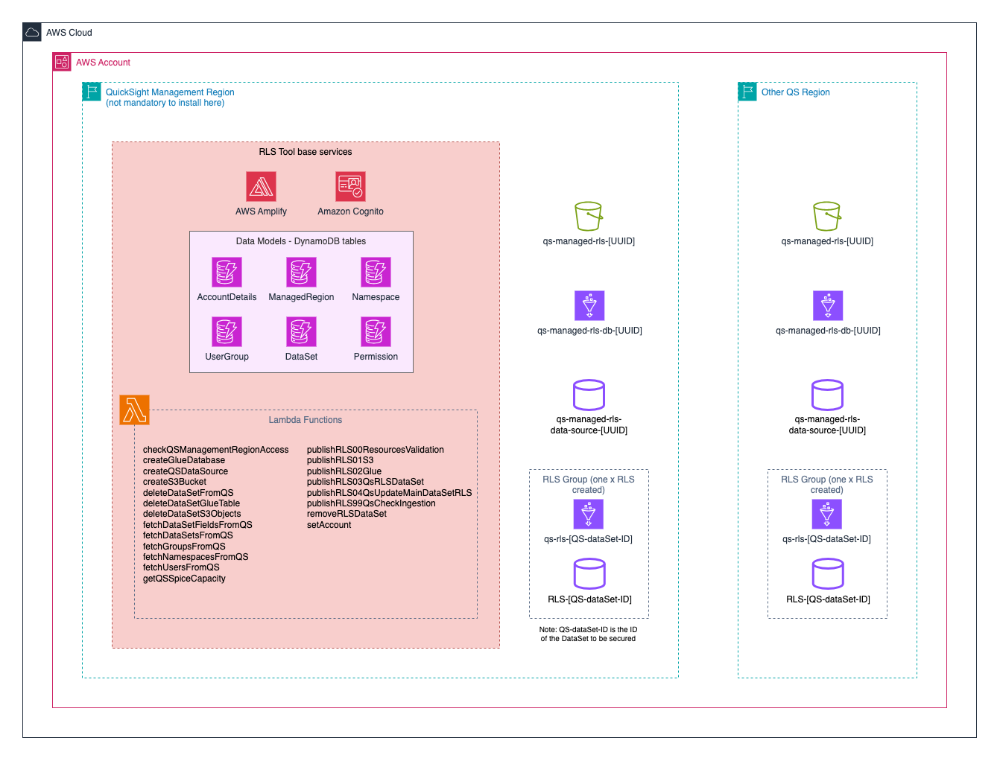

# QuickSight Row Level Security Manager

A comprehensive solution for managing Amazon QuickSight Row-Level Security (RLS) through an intuitive web interface, built with AWS Amplify.

**Developed by**: *andrepgn@amazon.com*  
**Contact**: Please refer to **andrepgn** for questions, bug reports, or feature requests.

⚠️ **Note**: This is not an official AWS Solution.

---

## 📋 Table of Contents

* [Overview](#overview)
* [The Problem](#the-problem)
* [The Solution](#the-solution)
* [Key Features](#key-features)
* [How It Works](#how-it-works)
* [Architecture](#architecture)
* [QuickSight Multi-Region Concepts](#quicksight-multi-region-concepts)
* [Getting Started](#getting-started)
* [Documentation](#documentation)
* [Known Limitations](#known-limitations)
* [Requirements](#requirements)
* [Contributing](#contributing)

---


## Overview

The **QuickSight RLS Manager** simplifies the complex process of managing Row-Level Security in Amazon QuickSight. Instead of manually creating and updating CSV files, this solution provides a visual interface to create, edit, and publish RLS permissions with full automation, version control, and audit trails.

## The Problem

Managing Row-Level Security in QuickSight presents several challenges:

### User/Group-Based RLS Challenges

❌ **Manual CSV Management** - Requires creating and maintaining CSV files in specific format  
❌ **Complex Format** - CSV must follow exact format: `UserName,field1,field2...` OR `GroupName,field1,field2...` OR `UserARN,GroupARN,field1...`  
❌ **Two Bad Options**:
  - Upload CSV manually for every change (tedious, error-prone)
  - Build and maintain database infrastructure (complex, costly)  
❌ **Error-Prone Process** - Manual editing can expose wrong data to wrong users  
❌ **No Version Control** - Difficult to track changes or rollback mistakes  
❌ **Difficult to Scale** - Managing hundreds of users becomes unmanageable  
❌ **No Audit Trail** - Can't track who changed what and when  
❌ **Schema Changes** - DataSet changes require manual CSV updates  
❌ **No Visibility** - Hard to understand who can see what data  
❌ **Infrastructure Overhead** - Must build and maintain supporting infrastructure

### Comparison with Anonymous Embedding RLS

**Anonymous Embedding RLS** (Tag-based):
- ✅ Easy to manage via tags
- ✅ Friendly UI in QuickSight console
- ✅ Straightforward implementation

**User/Group-Based RLS** (Dataset-based):
- ❌ Requires separate RLS DataSet
- ❌ Manual CSV file management
- ❌ Complex maintenance

**Reference**: [AWS QuickSight RLS Documentation](https://docs.aws.amazon.com/quicksight/latest/userguide/restrict-access-to-a-data-set-using-row-level-security.html)

## The Solution

The **QuickSight RLS Manager** transforms RLS management through:

✅ **Visual Interface** - Intuitive web UI for creating and managing permissions  
✅ **Automated Publishing** - One-click deployment to QuickSight  
✅ **Infrastructure Included** - All supporting infrastructure deployed and maintained for you  
✅ **No Manual Uploads** - Automated CSV generation and publishing  
✅ **No Database Maintenance** - S3, Glue, and Athena automatically configured  
✅ **Version Control** - Track all changes with rollback capability  
✅ **Audit Trail** - Complete history of who changed what and when  
✅ **Multi-Region Support** - Manage RLS across multiple AWS regions (if you have multi-region QuickSight)  
✅ **Error Prevention** - Validation before publishing prevents mistakes  
✅ **Centralized Management** - Single interface for all DataSets  
✅ **AWS Amplify Powered** - Complete infrastructure as code deployment

### How It Works

```
┌─────────────────────────────────────────────────────────────┐
│                    RLS MANAGER WORKFLOW                      │
└─────────────────────────────────────────────────────────────┘

1. CREATE PERMISSIONS          2. PUBLISH              3. VERIFY
   ┌──────────────┐              ┌──────────┐           ┌─────────┐
   │ Use Web UI   │      →       │ Automated│    →      │ Monitor │
   │ Add Users    │              │ 6-Step   │           │ Status  │
   │ Define Rules │              │ Workflow │           │ & Test  │
   └──────────────┘              └──────────┘           └─────────┘
         ↓                             ↓                      ↓
   Stored in                    CSV → S3 → Glue         RLS Active
   DynamoDB                     → QuickSight RLS         in QuickSight
```

### Comparison: Manual vs RLS Manager

| Aspect | Manual CSV Upload | Database/Data Source | RLS Manager |
|--------|-------------------|----------------------|-------------|
| **Setup Time** | Minutes | Days/Weeks | 15-20 minutes |
| **Data Format** | Manual CSV editing | Database tables/views | Automatic |
| **Infrastructure** | None (just CSV) | Build & maintain | Deployed for you |
| **Data Source** | CSV file | Database/S3/etc. | S3 + Glue + Athena |
| **Updates** | Re-upload CSV | Update database/ETL | Click "Publish" |
| **Version Control** | ❌ None | Manual | ✅ Built-in |
| **Audit Trail** | ❌ None | Manual | ✅ Automatic |
| **Rollback** | ❌ Not possible | Manual | ✅ One-click |
| **Error Prevention** | ❌ None | Manual validation | ✅ Automatic validation |
| **Maintenance** | Low | High | None |
| **Scalability** | Poor | Good | Excellent |
| **Cost** | Low | High | Medium |

**Time to Deploy**: 15-20 minutes  
**Time to First Permission**: 5-10 minutes  
**Publishing Time**: 2-5 minutes per DataSet

## Key Features

### 🎯 Core Capabilities

- **Visual Permission Management** - Create, edit, and delete permissions through intuitive UI
- **Automated Publishing** - 6-step automated workflow applies changes to QuickSight
- **Multi-Region Support** - Manage RLS across multiple AWS regions from single interface
- **Version Control** - Every publish creates a new version with rollback capability
- **Audit Trail** - Complete history of all permission changes with timestamps
- **Error Recovery** - Comprehensive error handling and retry logic

### 🔧 Advanced Features

- **Bulk Operations** - Import/export permissions via CSV for bulk updates
- **Permission Templates** - Reusable permission patterns for common scenarios
- **User/Group Sync** - Automatic synchronization with QuickSight
- **SPICE Monitoring** - Real-time capacity tracking and alerts
- **GraphQL API** - Programmatic access for automation
- **Status Tracking** - PENDING, PUBLISHED, FAILED, and MANUAL status indicators

### 🛡️ Security & Compliance

- **IAM Integration** - Fine-grained AWS permissions and roles
- **Encryption** - Data encrypted at rest (DynamoDB, S3) and in transit
- **Access Logging** - CloudTrail integration for compliance auditing
- **Role-Based Access** - Cognito-based authentication and authorization
- **Data Residency** - Regional data storage for compliance requirements

### 📊 Management Features

- **Manageable DataSets** - Full automation for API-compatible DataSets
- **Un-Manageable DataSets** - CSV generation for file-upload DataSets (MANUAL status)
- **Version History** - View and rollback to any previous version
- **Export/Import** - Download permissions as CSV for backup or migration
- **Real-Time Monitoring** - Track publishing progress and SPICE ingestion

## QuickSight Multi-Region Concepts

Understanding how QuickSight resources are distributed across AWS regions is crucial for using the RLS Manager effectively.

### Management Region vs Managed Regions

**Management Region**:
- The AWS region where you first created your QuickSight account
- Where user and group management occurs
- Typically `us-east-1` or your organization's primary region
- Set once during RLS Manager initialization

**Managed Regions**:
- AWS regions where your DataSets and RLS rules are deployed
- Can be different from the Management Region
- Multiple regions can be managed simultaneously (if you have multi-region QuickSight deployment)
- Each region has its own S3 bucket, Glue database, and DataSource

### Regional vs Global Resources

**Regional Resources** (Specific to each AWS Region):
- 📊 DataSources
- 📊 DataSets
- 📊 Dashboards
- 📊 Analyses
- 💾 [SPICE Capacity](https://docs.aws.amazon.com/quicksight/latest/user/spice.html)

**Global Resources** (Managed in Management Region):
- 👥 Users
- 👥 Groups
- 📁 Namespaces

**Learn More**: [Understanding Namespaces, Groups, Users and Shared Folder in Amazon QuickSight](https://community.amazonquicksight.com/t/understanding-namespaces-groups-users-and-shared-folder-in-amazon-quicksight/13158)


## How It Works

### QuickSight RLS Requirements

To enable RLS on a QuickSight DataSet, you need:

1. **Main DataSet** - The DataSet containing your business data
2. **RLS DataSet** - A separate DataSet with permission rules in one of three formats:
   - **User-based**: `UserName,field1,field2,field3...`
   - **Group-based**: `GroupName,field1,field2,field3...`
   - **ARN-based**: `UserARN,GroupARN,field1,field2,field3...`
   
   The RLS DataSet can be created from:
   - CSV file uploaded to QuickSight
   - Database table/view you create and maintain
   - S3 file queried via Athena
   - Any other QuickSight-supported data source
3. **Link** - The Main DataSet must be linked to the RLS DataSet

**Reference**: [AWS QuickSight RLS Documentation](https://docs.aws.amazon.com/quicksight/latest/userguide/restrict-access-to-a-data-set-using-row-level-security.html)

**Manual Process** (Without RLS Manager):

**Option 1: Manual CSV Upload** (Simple but tedious)
- Create CSV file with permission rules in one of three formats:
  - `UserName,SalesRegion,Segment` (user-based)
  - `GroupName,SalesRegion,Segment` (group-based)
  - `UserARN,GroupARN,SalesRegion` (ARN-based)
- Upload CSV manually to QuickSight console
- Create RLS DataSet from uploaded CSV
- Link RLS DataSet to Main DataSet
- **Repeat entire process for every permission change**
- No automation, no version control, no audit trail

**Option 2: Database/Data Source Infrastructure** (Complex but scalable)
- Design and create database tables or data structures for permissions
- Build ETL processes to populate and maintain permission data
- Create database views or queries with correct format
- Set up data synchronization and refresh processes
- Create RLS DataSet from your database/data source
- Link RLS DataSet to Main DataSet
- **Maintain entire infrastructure** (database, ETL, monitoring, data consistency)
- Update processes when schema or requirements change
- Handle failures, performance issues, and data synchronization
- Keep permission data up-to-date across systems

**Automated Process** (With RLS Manager):
- **Create permissions** in intuitive web UI
- **Click "Publish"**
- **Everything else is automated**:
  - CSV automatically generated in correct format
  - S3 bucket created and managed for you
  - Glue database and tables configured automatically
  - Athena DataSource set up and maintained
  - RLS DataSet created and updated
  - Main DataSet linked automatically
  - Version control built-in
  - Audit trail automatic
- **No manual CSV uploads**
- **No database infrastructure to build or maintain**
- **No ETL processes to manage**
- **Infrastructure deployed and maintained for you**

### RLS Manager Automation

The RLS Manager automates the entire process by creating and managing:

#### Per Region Resources

**Amazon S3 Bucket** - `qs-managed-rls-[UUID]`
- Stores RLS CSV files with versioning enabled
- One bucket per managed region
- Organized by DataSet ID for easy navigation
- Version history for rollback capability

**AWS Glue Database** - `qs-managed-rls-[UUID]`
- Metadata catalog for RLS tables
- One database per managed region
- One table per secured DataSet
- Enables Athena queries

**QuickSight DataSource** - `qs-managed-rls-[UUID]`
- Athena DataSource for querying Glue tables
- One DataSource per managed region
- Automatically configured with correct permissions

**RLS DataSets**
- One RLS DataSet per secured Main DataSet
- Automatically created and updated
- Tagged with `RLS-Manager: True`
- SPICE mode for performance

### Publishing Workflow (6 Steps)

When you click "Publish", the RLS Manager executes:

1. **Step 0: Validation** (~5s) - Verify resources exist and permissions are correct
2. **Step 1: S3 Upload** (~10s) - Generate CSV and upload to S3 with versioning
3. **Step 2: Glue Table** (~15s) - Create/update Glue table metadata
4. **Step 3: RLS DataSet** (~30s) - Create/update QuickSight RLS DataSet
5. **Step 4: Apply RLS** (~20s) - Link RLS DataSet to Main DataSet
6. **Step 99: Check Ingestion** (0-300s) - Monitor SPICE ingestion completion

**Total Time**: 2-5 minutes (typical)

**Learn More**: [Complete Publishing Workflow Documentation](Guide/TheGuide.md#publishing-workflow-6-steps)


## Architecture

The RLS Manager is built using AWS Amplify and leverages multiple AWS services for a complete, scalable solution.

### Architecture Diagram



### AWS Services Used

**Frontend & Hosting**:
- 🌐 **AWS Amplify** - Hosts React web application with CI/CD
- 🔐 **Amazon Cognito** - User authentication and authorization

**Data Storage**:
- 📊 **Amazon DynamoDB** - 5 tables for permissions, DataSets, and configuration
- 📁 **Amazon S3** - Stores RLS CSV files with versioning (per region)

**Data Processing**:
- ⚡ **AWS Lambda** - 27 functions for automation and orchestration
- 🗃️ **AWS Glue** - Data catalog for RLS table metadata (per region)
- 🔍 **Amazon Athena** - Queries Glue tables (via QuickSight DataSource)

**Business Intelligence**:
- 📊 **Amazon QuickSight** - Applies RLS and serves dashboards

**API & Integration**:
- 🔗 **AWS AppSync** - GraphQL API for data management
- 📝 **Amazon CloudWatch** - Logs, metrics, and monitoring

**Security**:
- 🔑 **AWS IAM** - Service permissions and roles
- 🔒 **AWS KMS** - Encryption at rest

### Deployment Model

**Base Services** (Deployed by Amplify):
- Web application and hosting
- Cognito user pool
- DynamoDB tables
- Lambda functions
- AppSync GraphQL API
- IAM roles and policies

**Regional Resources** (Created per managed region):
- S3 bucket for CSV files
- Glue database and tables
- QuickSight DataSource
- RLS DataSets (per secured DataSet)

**Learn More**: [Detailed Architecture Documentation](Guide/Amplify-Resources.md)

## Getting Started

### Prerequisites

Before installing the RLS Manager, ensure you have:

- ✅ **AWS Account** with administrative access
- ✅ **Amazon QuickSight** enabled and configured
- ✅ **QuickSight Enterprise Edition** (required for RLS features)
- ✅ **GitHub Account** for forking the repository
- ✅ **Node.js 18+** and npm installed (for local development)
- ✅ **AWS CLI** configured with appropriate credentials

### Quick Start (3 Steps)

#### 1. Install (15-20 minutes)

Deploy the RLS Manager to your AWS account using AWS Amplify:

```bash
# Fork the repository on GitHub
# Then deploy via Amplify Console
```

**Detailed Instructions**: [Installation Guide](Guide/Install.md)

#### 2. Initialize (10-15 minutes)

Configure your QuickSight regions and resources:

- Set QuickSight Management Region
- Add Managed Regions
- Configure QuickSight permissions

**Detailed Instructions**: [Initialization Guide](Guide/Initialization.md)

#### 3. Manage Permissions (5-10 minutes)

Create and publish your first RLS permissions:

- Select a DataSet
- Add permissions for users/groups
- Publish to QuickSight
- Verify RLS is working

**Detailed Instructions**: [Managing Permissions Guide](Guide/Manage-Permissions.md)

### Total Setup Time

- **Installation**: 15-20 minutes
- **Initialization**: 10-15 minutes
- **First Permission**: 5-10 minutes
- **Total**: ~30-45 minutes

---

## Documentation

### 📚 Complete Guides

- **[The Complete Guide](Guide/TheGuide.md)** - Comprehensive overview of all features
- **[Installation Guide](Guide/Install.md)** - Step-by-step installation instructions
- **[Initialization Guide](Guide/Initialization.md)** - Initial setup and configuration
- **[Managing Permissions Guide](Guide/Manage-Permissions.md)** - Creating and publishing RLS rules

### 🔧 Technical Documentation

- **[Amplify Resources](Guide/Amplify-Resources.md)** - Detailed AWS resources and data models
- **[Lambda Functions](Guide/Amplify-Resources.md#lambda-functions)** - Complete function documentation (27 functions)
- **[DynamoDB Tables](Guide/Amplify-DynamoDb.md)** - Database schema and structure

### 📖 Additional Resources

- **[Architecture Deep Dive](Guide/TheGuide.md#architecture)** - Detailed system architecture
- **[Troubleshooting Guide](Guide/TheGuide.md#troubleshooting)** - Common issues and solutions
- **[FAQ](Guide/TheGuide.md#frequently-asked-questions)** - Frequently asked questions
- **[Best Practices](Guide/Manage-Permissions.md#best-practices)** - Recommended approaches

---

## Known Limitations

### QuickSight RLS Limitations

These are limitations of Amazon QuickSight's Row-Level Security feature, not the RLS Manager:

#### 1. Date and Numeric Fields Not Supported

**Official QuickSight Limitation:**

> "Currently date column is not supported in RLS. Row-level security works only for fields containing textual data (string, char, varchar, and so on). It doesn't currently work for dates or numeric fields. Anomaly detection is not supported for datasets that use row-level security (RLS)."

**Source**: [AWS QuickSight Documentation - Row-Level Security](https://docs.aws.amazon.com/quicksight/latest/user/restrict-access-to-a-data-set-using-row-level-security.html)

**Impact**:
- ❌ RLS can only be applied to text/string fields
- ❌ Date fields cannot be used for row-level filtering
- ❌ Numeric fields cannot be used for row-level filtering
- ❌ Anomaly detection features are disabled when RLS is enabled

**Workaround**:
- Convert date/numeric fields to string format in your data source
- Use string representations: `"2024-12-03"` instead of date type
- Use string representations: `"12345"` instead of integer type

#### 2. New Data Prep Experience API Limitations

When using DataSets created with QuickSight's new data prep experience:

**Issue with Date Type Transformations**:
- Cannot add RLS via API if DataSet has date type transformation nodes
- Cannot create date type transformations if RLS is already applied via API

**Workaround**:
- Apply date type transformations before adding RLS
- To modify date transformations: remove RLS → make changes → re-apply RLS

**Technical Details**: This affects `CastColumnTypesStep` operations in `DataPrepConfiguration.TransformStepMap`

### RLS Manager Limitations

#### 1. Single AWS Account

- Currently manages one AWS account
- Multi-account support planned for future releases

#### 2. Un-Manageable DataSets

DataSets created by directly uploading files to QuickSight cannot be managed via API:
- RLS Manager can generate CSV for these DataSets (MANUAL status)
- You must manually download CSV and upload to QuickSight
- Permissions are tracked but not automatically published

**Learn More**: [Working with MANUAL Permissions](Guide/Manage-Permissions.md#working-with-manual-permissions)

---

## Requirements

### AWS Services

- **Amazon QuickSight** - Enterprise Edition required
- **AWS Amplify** - For hosting and deployment
- **Amazon Cognito** - For authentication
- **Amazon DynamoDB** - For data storage
- **AWS Lambda** - For automation
- **Amazon S3** - For CSV storage
- **AWS Glue** - For data catalog
- **Amazon Athena** - For querying (via QuickSight)
- **AWS IAM** - For permissions management

### Costs

Typical monthly costs (varies by usage):

- **AWS Amplify**: ~$5-20/month (hosting and build minutes)
- **Amazon QuickSight**: Based on your existing subscription
- **SPICE Capacity**: Based on RLS DataSet sizes
- **DynamoDB**: ~$5-10/month (on-demand pricing)
- **Lambda**: ~$1-5/month (within free tier for most use cases)
- **S3**: ~$1-5/month (storage and requests)
- **Glue**: ~$1-5/month (catalog storage)

**Estimated Total**: $50-200/month depending on scale

**Note**: Costs vary significantly based on:
- Number of DataSets managed
- Number of permissions
- Publishing frequency
- SPICE capacity requirements

---

## Contributing

Contributions are welcome! Please contact **andrepgn@amazon.com** for:

- 🐛 Bug reports
- 💡 Feature requests
- 🔧 Code contributions
- 📖 Documentation improvements
- ❓ Questions and support

### Reporting Issues

When reporting issues, please include:

1. **Description** - Clear description of the issue
2. **Steps to Reproduce** - How to reproduce the problem
3. **Expected Behavior** - What you expected to happen
4. **Actual Behavior** - What actually happened
5. **Logs** - Relevant CloudWatch logs or error messages
6. **Environment** - AWS region, QuickSight version, etc.

---

## License

This project is provided as-is for use with Amazon QuickSight.

⚠️ **Disclaimer**: This is not an official AWS Solution. Use at your own discretion.

---

## Additional Resources

### AWS Documentation

- [Amazon QuickSight Documentation](https://docs.aws.amazon.com/quicksight/)
- [Row-Level Security in QuickSight](https://docs.aws.amazon.com/quicksight/latest/user/restrict-access-to-a-data-set-using-row-level-security.html)
- [AWS Amplify Documentation](https://docs.amplify.aws/)
- [QuickSight API Reference](https://docs.aws.amazon.com/quicksight/latest/APIReference/)

### Community Resources

- [Understanding QuickSight Namespaces, Groups, and Users](https://community.amazonquicksight.com/t/understanding-namespaces-groups-users-and-shared-folder-in-amazon-quicksight/13158)
- [QuickSight Community Forums](https://community.amazonquicksight.com/)

---

## Support

For questions, issues, or feature requests:

📧 **Email**: andrepgn@amazon.com  
📖 **Documentation**: [Complete Guide](Guide/TheGuide.md)  
🐛 **Issues**: Contact maintainer directly

---

**Ready to get started?** Follow the [Installation Guide](Guide/Install.md) to deploy the RLS Manager in your AWS account.

